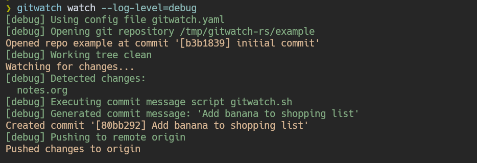

<div align="center">

<h1>gitwatch-rs</h1>
<em>Watch a Git repository and automatically commit changes</em><br/><br/>

[](https://codecov.io/gh/croissong/gitwatch-rs)
[](https://github.com/croissong/gitwatch-rs/releases/latest)
[](https://crates.io/crates/gitwatch-rs)

</div>

A Rust implementation of the original [gitwatch](https://github.com/gitwatch/gitwatch) script - with a few additional features.

- [Features](#features)
- [Usage](#usage)
  - [Configuration](#configuration)
  - [Tips](#tips)
- [Installation](#installation)
- [Contributing](#contributing)
- [Credits](#credits)
- [Contributing](#contributing)

## Features

- Watch a local Git repository and automatically commit changes
- Optionally push to a remote 
- Use a custom commit message or generate one via a script
- Configure a debounce time to limit commit frequency 


## Usage

Basic usage:
```sh
gitwatch watch /path/to/repo --commit-message "Auto commit"
```

<details>
<summary><b>Example use case</b></summary>

I use gitwatch to watch my local notes repository and generate commit messages using [aichat](https://github.com/sigoden/aichat).  
The [example](example/) folder contains a small repository demonstrating this use case:



</details>

### Configuration

```console
❯ gitwatch watch --help
Watch a repository and commit changes

Usage: gitwatch watch [OPTIONS] [REPOSITORY]

Arguments:
  [REPOSITORY]  Path to the Git repository to monitor for changes [default: .]

Options:
  -m, --commit-message <MESSAGE>
          Static commit message to use for all commits
      --commit-message-script <SCRIPT>
          Path to executable script that generates commit messages.
          The path can be absolute or relative to the repository.
          The script is executed with the repository as working directory
          and must output the message to stdout.
      --commit-on-start <COMMIT_ON_START>
          Automatically commit any existing changes on start [default: true] [possible values: true, false]
      --debounce-seconds <DEBOUNCE_SECONDS>
          Number of seconds to wait before processing multiple changes to the same file.
          Higher values reduce commit frequency but group more changes together. [default: 1]
      --dry-run
          Run without performing actual Git operations (staging, committing, etc.)
  -i, --ignore-regex <IGNORE_REGEX>
          Regular expression pattern for files to exclude from watching.
          Matching is performed against repository-relative file paths.
          Note: the .git folder & gitignored files are ignored by default.
          Example: "\.tmp$" to ignore temporary files.
      --log-level <LOG_LEVEL>
          Set the log level [default: info] [possible values: trace, debug, info, warn, error]
  -r, --remote <REMOTE>
          Name of the remote to push to (if specified).
          Example: "origin".
      --retries <RETRIES>
          Number of retry attempts when errors occur.
          Use -1 for infinite retries. [default: 3]
  -w, --watch <WATCH>
          Enable continuous monitoring of filesystem changes.
          Set to false for one-time commit of current changes. [default: true] [possible values: true, false]
  -h, --help
          Print help
```

#### Config file

Most options can also be configured in a `gitwatch.yml` file located at the root of the watched repository.
See [docs/gitwatch.example.yaml](docs/gitwatch.example.yaml) for reference.


### Tips

<details><summary><b>Disable GPG commit signing for your watched repo</b></summary>

If you've enabled `gpgsign` globally, you might want to disable it for the watched repositories, since `gitwatch` uses your regular git user to create the commits.

1. Add an include to a custom `.gitconfig` file to your local gitconfig:
   ```sh
   # cd /path/to/repo 
   git config --local include.path ../.gitconfig
   ```
2. Create a .gitconfig file (which can be committed):
   ```gitconfig
   [commit]
     gpgsign = false
   ```

</details>

<details><summary><b>Run as systemd service</b></summary>

Create a systemd user service file `gitwatch@.service`:
```ini
[Unit]
Description=Watch a Git repository and automatically commit changes

[Service]
ExecStart=/usr/local/bin/gitwatch watch %I
ExecStop=/bin/true

[Install]
WantedBy=default.target
```

I recommend you use it in combination with a config file, then you only need to pass the repo dir as argument:
```sh
systemctl --user start gitwatch@$(systemd-escape /path/to/repo/).service
```
   
   
There's also a [Nix module](nix/service.nix), which provides a home-manager service:
```nix
inputs = {
   gitwatch-rs.url = "github:croissong/gitwatch-rs";
};

...
  
imports = [ inputs.gitwatch-rs.modules.gitwatch ];

services.gitwatch = {
  notes = {
    repo_path = "${config.home.homeDirectory}/notes/";
    args = [ "--log-level=debug" ];
    extraPackages = with pkgs; [
      bash
      coreutils
      git
      aichat
    ];
  };
}
```

</details>

## Installation

<details><summary><b>Nix</b></summary>

A [flake.nix](./flake.nix) is available for Nix:
```nix
inputs = {
  gitwatch-rs.url = "github:croissong/gitwatch-rs";
};
# Reference the package as `inputs.gitwatch-rs.packages.<system>.default`
```

</details>


<details><summary><b>Arch Linux</b></summary>

[AUR package](https://aur.archlinux.org/packages/gitwatch-rs-bin)
```sh
paru -S gitwatch-rs-bin
```

</details>


<details><summary><b>Ubuntu</b></summary>

```sh
# TODO: Add Ubuntu package
```

</details>


<details><summary><b>Cargo</b></summary>

[crates.io](https://crates.io/crates/gitwatch-rs):
```sh
cargo install gitwatch-rs
```

</details>


<details><summary><b>Docker</b></summary>

[ghcr.io/croissong/gitwatch-rs](https://github.com/croissong/gitwatch-rs/pkgs/container/gitwatch-rs):
```sh
docker run -v /path/to/repo:/repo ghcr.io/croissong/gitwatch-rs:latest /repo
```

</details>


<details><summary><b>Binaries</b></summary>

Precompiled binaries are available for Linux and macOS from [releases](https://github.com/croissong/gitwatch-rs/releases).

</details>
 


### Shell completion

Shell completion scripts for `bash`, `zsh`, `fish` & more can be generated via:
```sh
gitwatch completion <SHELL>
```

## Credits

This is a Rust implementation of the original [gitwatch](https://github.com/gitwatch/gitwatch) bash script.  
 
## Contributing

Contributions are welcome! Feel free to submit a Pull Request.  
See [CONTRIBUTING.md](CONTRIBUTING.md) for development hints.

